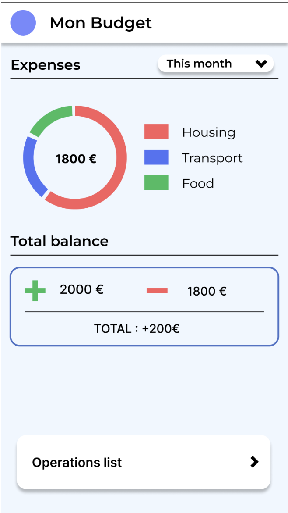
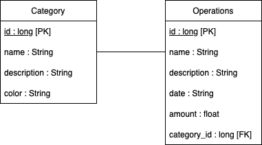

# DEVMOney Application

## Vue Principale : MyBudget 

### Description 

La vue principale Mybudget issue de **MainActivity** affiche les dernières dépenses **Last Expenses** par catégorie. Ces dépenses sont enregistrées dans une base de donnée qui sera présentée plus bas.
En dessous, on peut constater la somme des **income** et des **expenses** pour donner le **Total**. ces données sont récupérées à partir de la base de donnée, en faisant les sommes par catégorie.

### UI Components

Le design intitial de cette vue était le suivant : 

Nous avons adapté le design pour le rendre plus simple, notamment en remplaçant le diagramme des dépenses par catégories par des barres.
De la même manière, nous avons préféré éliminer l\'affichage par periode pour des raisons de simplicité. Ce qui est affiché correspond donc à l\'ensemble des éléments présents dans la base de données 
Autrement le reste des éléments d'interface de la vue ont pu être implémentés et correspondent à notre design originel.

## Vue secondaire : Operations 

### Description 

Dans cette vue est recensé les différentes opérations de dépenses présentes dans la base de données. L'utilisateur peut ajouter des items via le menu +, qui les ajoute à la base de données.

### UI Components

Le design intitial de cette vue était le suivant : 

Tous les éléments ont pu être implémentés à l'exception de la coloration des pastilles. Le principe à utiliser est équivalent à celui appliqué pour la coloration des pastilles des éléments de **Last Expenses**.
Encore une fois, ce sont toutes les dépenses présentes dans la base de données qui son affichées à l\'ecran.

## Vue tertiaire : Ajout d'opérations

Cette dernière activité permet à l'utilisateur de remplir un formulaire afin de créer une nouvelle opération. L'utilisateur y est amené à choisir un nom, une date, une description et une catégorie pour la nouvelle opération.

Le choix de la catégorie se fait au moyen d'un menu déroulant (dropdown) qui est remplie avec les catégories présentes dans la base de données.

En raison des limites de temps que nous avions, nous nous sommes contentés d'un formulaire très simple : nous ne vérifions pas le contenu de chacun des champs avant de les ajouter à la base de données et il est donc probablement possible de lever des exceptions que nous ne gérons pas. Cependant, la base de données est protégée contre les tentatives d'injection SQL.

## Base de données

La base de donnée est présente à l'adresse *com.patigny_baudet.devmoney/models/database*. Elle correspond au modèle suivant : 

  
 
 Cette base de donnée simple nous permet de stocker toutes les information nécessaires au bon fonctionnement des vues.
 
 
